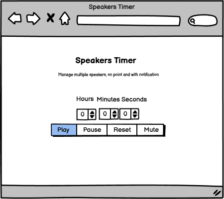

# Speakers Timer
This app is a timer designed to help speakers manage their time during virtual meetings.

The Speakers timer site is live, the links can be found [HERE](https://hypergeek-dev.github.io/Speakers-timer/)

## Table of Contents
+ [UX](#ux "UX")
  + [Site Purpose](#site-purpose "Site Purpose")
  + [Site Goal](#site-goal "Site Goal")
  + [Audience](#audience "Audience")
  + [Communication](#communication "Communication")
  + [Current User Goals](#current-user-goals "Current User Goals")
  + [New User Goals](#new-user-goals "New User Goals")
+ [Design](#design "Design")
  + [Colour Scheme](#colour-scheme "Colour Scheme")
  + [Typography](#typography "Typography")
  + [Imagery](#imagery "Imagery")
+ [Features](#features "Features")
  + [Existing Features](#existing-features "Existing Features")
+ [Testing](#testing "Testing")
  + [Validator Testing](#validator-testing "Validator Testing")
  + [Unfixed Bugs](#unfixed-bugs "Unfixed Bugs")
+ [Technologies Used](#technologies-used "Technologies Used")
  + [Main Languages Used](#main-languages-used "Main Languages Used")
  + [Frameworks, Libraries & Programs Used](#frameworks-libraries-programs-used "Frameworks, Libraries & Programs Used")
+ [Deployment](#deployment "Deployment")
+ [Credits](#credits "Credits")
  + [Content](#content "Content")
  + [Media](#media "Media")

## UX

### Site Purpose:
This code is for a timer that is designed to assist virtual meetings in managing the length of individual speeches. The timer is set up with input fields for hours, minutes, and seconds. The user can input the desired length of the speech, and then start the timer. Once the timer is started, the user can pause and reset the timer as needed.

### Site Goal:
To improve the quality of the meeting by assisting in time-management

### Audience:
Anyone & everyone.

### Communication:
The use of the app becomes clear upon visiting the site due to the chosen font and clearly defined buttons.. 

### Current User Goals:
The app's usability is enhanced by its simplicity.

### New User Goals:
To become instantly engaged with the design of the site, and feel appealed to use the timer.

### Future Goals:
Can be used in colaboration with other meeting tools as a full package
Can integrate with API on eg. zoom to be more interactive. 

## Design

### Wireframes:

### Colour Scheme:
I chose to use greyscale.

### Typography:
All fonts were obtained from the Google Fonts library. I chose the following two fonts for the page:
1. Days One
2. Luckiest Guy

### Imagery:
Only one image is used as wallpaper. Accreditation is further down.

## Features

1. Timer with Hours, Minutes and Seconds.
2. Ability to pause
3. Ability to Reset to last preset time used.
4. Ability to mute notification sound.

## Notifications

#### Landing Page:

## Testing
Initial testing revealed a bug whereby you could press play several times and the countdown would then count irratic. I solved this by using an eventlistener.
That has been the only issue in Javascript. The issues that took most of my time was styling in CSS. 

### Validator Testing
- html files pass through the [W3C validator](https://validator.w3.org/) with no issues found.

- CSS files pass through the [Jigsaw validator](https://jigsaw.w3.org/css-validator/) with no issues found.

  

- JS files pass through [JSHint](https://jshint.com/) with no issues found.

- page has an excellent Accessibility rating in Lighthouse

- Tested the site opens in Brave, Chrome & Safari without issues.
- All links open to external pages as intended.

### Unfixed Bugs

There are no unfixed errors. 

## Technologies Used
### Main Languages Used
- HTML5
- CSS3
- Javascript

### Frameworks, Libraries & Programs Used
- Google Fonts - for the font families: 
- Font Awesome - to add icons to the social links in the footer element.
- GitPod - to create my html files & styling sheet before pushing the project to Github.
- GitHub - to store my repository for submission.
- Balsamiq - were used to create mockups of the project prior to starting.
- Am I Responsive? - to ensure the project looked good across all devices.
- Font Awsome - to provide the code & image for the icon in the tab bar.

## Deployment
The site was deployed to GitHub pages. The steps to deploy are as follows:
- In the GitHub repository, navigate to the Settings tab
- From the source section drop-down menu, select the Master Branch
- Once the master branch has been selected, the page will be automatically refreshed with a detailed ribbon display to indicate the successful deployment.
- The live link can be found [HERE - Speakers Timer](https://hypergeek-dev.github.io/Speakers-timer/)

## Credits
I like to thank Martina Terlević (https://www.linkedin.com/in/martinaterlevic/)
### Content
All written content is created by me

The javascript and CSS for the buttons were found on
https://dev.to/webdeasy/top-20-css-buttons-animations-f41
and edited to own purpose

### Media
The verbal notification is created using
Text to speech, using this site:
https://speechgen.io/

The wallpaper was found on
https://wallpapercave.com/
